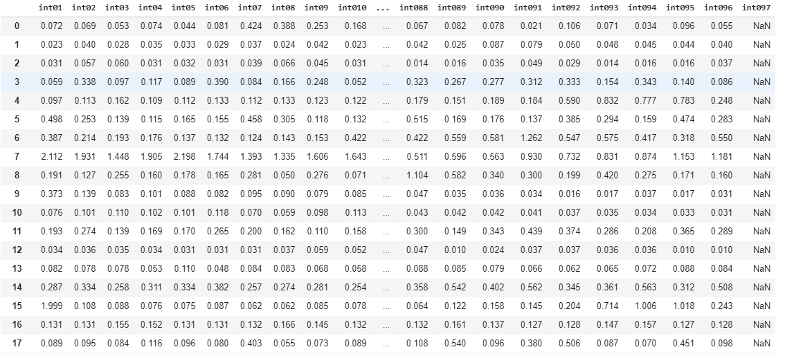

## Energy Usage Analysis (done using Python libraries)
### Problem Statement:
There are various customers in Energy domain (electricity) who drop off as a customer due to some reasons, while others stick to the electricity provider. The aim is to come up with an evaluation which provide some insight on the usage pattern of the customers who dropped in comparison to those who didn't. So that better services could be provided to existing customers.

### Data:
Data consists of 'Customer Id', 'Date of Record', 'int01', 'int02', ... 'int100'. Where int01 - int100 are the usages recorded in 15 minute interval for the stated day (Extra fields due to daylight saving)

#### Cleaned Data:

#### Converted to Hourly Data:

#### Data Description:

- There were some customers who haven't used electricity at all even after subscription.
- Mean is highest at 19th Hour, that's the time when people start settling down after dinner.

#### Correlation of Hourly Data:

- Usage of 2nd, 3rd, 4th and 5th hour are highly correlated to each other. Meaning, if the fluctuations in usage in either hour results in change of usage in others.
- Usage of hour 6 to 10 are very loosely correlated with usage in hour 11 to 24